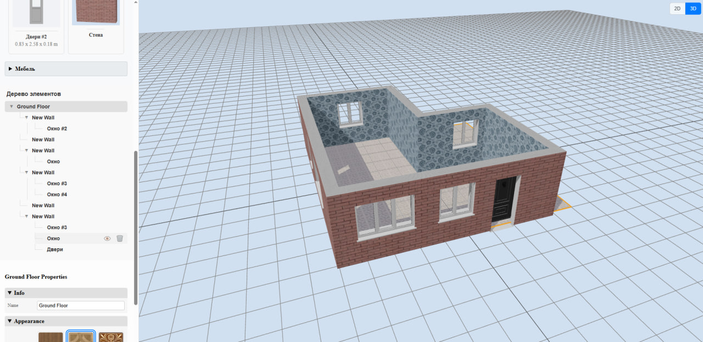
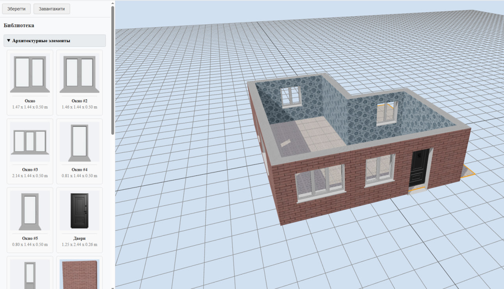
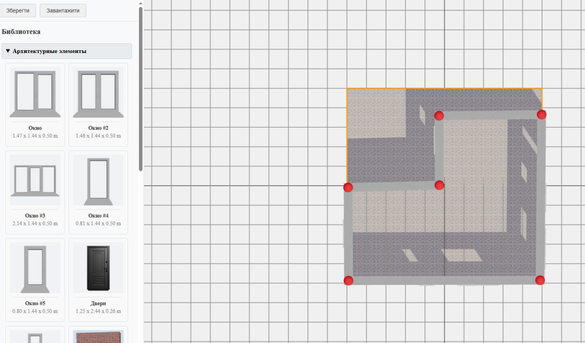

## FloorPlan 3D: Архитектурная основа для коммерческих редакторов интерьера

**FloorPlan 3D** — это не просто демонстрационный проект, а **мощная архитектурная основа (boilerplate)**, предназначенная для создания полноценных коммерческих десктопных редакторов интерьера. Приложение демонстрирует ключевые механики, необходимые для таких продуктов, включая два режима редактирования (2D/3D), параметрическое создание геометрии, интерактивную библиотеку объектов и подробную панель свойств. Проект разработан с акцентом на масштабируемость, что позволяет легко расширять его функционал и наполнять контентом.

### Ключевые возможности

*   **Двойной режим редактирования: 2D и 3D**
    *   Мгновенное переключение между видом сверху (2D-план) для удобного черчения и полноценной 3D-перспективой для визуализации и декорирования.

*   **Параметрическое создание стен**
    *   Интуитивное рисование стен и их редактирование с помощью интерактивных манипуляторов (`ResizeHandle`).
    *   Реализован алгоритм "прилипания" стен друг к другу и автоматическое создание правильных угловых соединений (`Miter Joints`).

*   **Динамические архитектурные элементы**
    *   Добавление окон и дверей, которые автоматически "вырезают" проёмы в стенах с помощью булевых CSG-операций в реальном времени.

*   **Drag-and-Drop библиотека объектов**
    *   Организованная библиотека 3D-моделей (мебель, декор), которые можно перетаскивать непосредственно в сцену.
    *   Реализованы всплывающие подсказки с большим превью модели при наведении.

*   **Интерактивные 3D-манипуляторы (Gizmo)**
    *   Выделенные объекты можно легко перемещать, вращать и масштабировать с помощью централизованного компонента `TransformControls`.

*   **Подробная панель свойств**
    *   Контекстно-зависимая панель, которая позволяет точно настраивать размеры, позицию, вращение и материалы любого выделенного объекта.
    *   Реализован визуальный селектор текстур с фильтрацией по тегам (напр., "для пола", "для стен").

*   **Сохранение и загрузка сцены**
    *   Полная сериализация состояния сцены (включая объекты, их свойства и иерархию) в JSON-файл для сохранения и последующей загрузки проектов.

*   **Полностью офлайн-работа**
    *   Приложение скомпилировано с помощью **Electron**, что позволяет ему работать как самостоятельная десктопная программа на Windows, macOS и Linux без доступа к интернету.

### Система автоматической генерации превью и метаданных

Для поддержки и легкого расширения библиотеки 3D-объектов был разработан специализированный внутренний инструмент — **генератор превью и метаданных**. Эта система полностью автоматизирует процесс создания визуальных иконок и сбора технических данных для каждого элемента библиотеки, устраняя необходимость в ручном создании скриншотов и вводе данных, что гарантирует консистентность и минимизирует риск ошибок.

#### Ключевые возможности системы

*   **WYSIWYG (What You See Is What You Get) рендеринг:** Система генерирует превью не из "сырых" 3D-моделей, а из **полностью сконфигурированных элементов**, как они описаны в `library-config.js`. Это означает, что если для модели указаны специфические замены материалов или трансформации, они будут применены перед рендерингом, и финальное изображение будет на 100% соответствовать тому, как объект будет выглядеть в сцене.

*   **Автоматическое извлечение метаданных:** Во время рендеринга система анализирует 3D-объект и автоматически собирает ключевые технические данные:
    *   **Финальные размеры (габариты):** Точные размеры объекта в метрах после применения всех масштабов.
    *   **Количество полигонов:** Важный показатель производительности модели.
    *   **Список материалов:** Полный перечень имён материалов, используемых в модели (с учётом замен).

*   **Поддержка всех типов компонентов:** Генератор универсален и может обрабатывать как **статические 3D-модели** (например, мебель из `.glb` файлов), так и **процедурные компоненты** (например, стены, которые генерируются программно).

*   **Централизованный вывод данных:** Результатом работы системы являются:
    1.  **Набор PNG-изображений:** Высококачественные превью для каждого элемента библиотеки.
    2.  **Единый файл `model-metadata.json`:** JSON-файл, служащий "единым источником правды" обо всех технических характеристиках объектов. Основное приложение загружает этот файл для отображения данных в библиотеке.

#### Преимущества данного подхода

*   **Масштабируемость:** Добавление сотен новых элементов в библиотеку не требует ручной работы — достаточно запустить генератор.
*   **Консистентность:** Все превью имеют одинаковый стиль, освещение и ракурс, что делает библиотеку визуально целостной.
*   **Точность:** Технические данные (размеры, полигоны) извлекаются автоматически, что исключает человеческий фактор и ошибки.
*   **Производительность:** Вся "тяжёлая" работа по анализу моделей выполняется один раз, офлайн. Основное приложение загружает только лёгкий и быстрый JSON-файл, не расходуя ресурсы пользователя.

### Технологический стек

*   **Frontend:** React
*   **3D-графика:** Three.js, React Three Fiber (R3F), React Three Drei
*   **Управление состоянием:** Zustand (с middleware Immer)
*   **Десктопная платформа:** Electron
*   **Дополнительные библиотеки:** `three-csg-ts` (для булевых операций), `Tippy.js` (для подсказок).

### Архитектурные особенности

*   **Динамический рендеринг компонентов:** Сцена строится на основе данных из стора, используя `componentMap` для рендеринга соответствующих React-компонентов.
*   **Централизованное управление состоянием:** Всё состояние сцены хранится в едином сторе Zustand, что обеспечивает предсказуемость и лёгкость отладки.
*   **Data-Driven UI:** Панель свойств для каждого объекта генерируется динамически на основе его статической схемы (`propertySchema`), что делает добавление новых объектов простым и масштабируемым.

### Проект как основа для коммерческого продукта

Благодаря продуманной архитектуре и масштабируемому подходу, этот проект является идеальной отправной точкой для разработки финального коммерческого продукта.

**Что уже реализовано (фундамент):**
*   **Масштабируемая система компонентов:** Легко добавлять новые типы объектов (например, лестницы, колонны, плинтусы), просто создав новый компонент и описав его `propertySchema`.
*   **Централизованный и предсказуемый менеджмент состояния:** Готовая система для работы со сложными сценами и их свойствами.
*   **Готовая архитектура для десктопного офлайн-приложения:** Решены все основные проблемы сборки и распространения.

**Направления для дальнейшего развития:**
*   **Расширение библиотек:** Лёгкое добавление сотен новых 3D-моделей мебели, текстур и материалов.
*   **Расширенный редактор материалов:** Возможность изменять не только текстуру, но и цвет, шероховатость, металличность материалов.
*   **Интеграция бизнес-логики:** Автоматический подсчёт площади помещений, стоимости материалов, генерация спецификаций и смет.
*   **Улучшение качества рендеринга:** Добавление глобального освещения (Ambient Occlusion), более реалистичных теней и эффектов постобработки.
